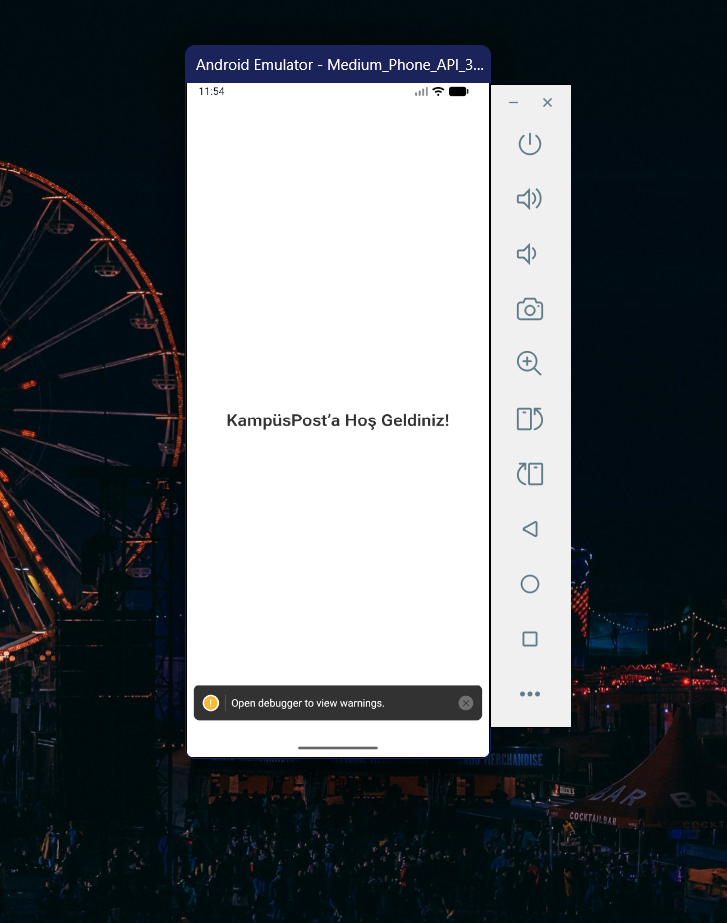
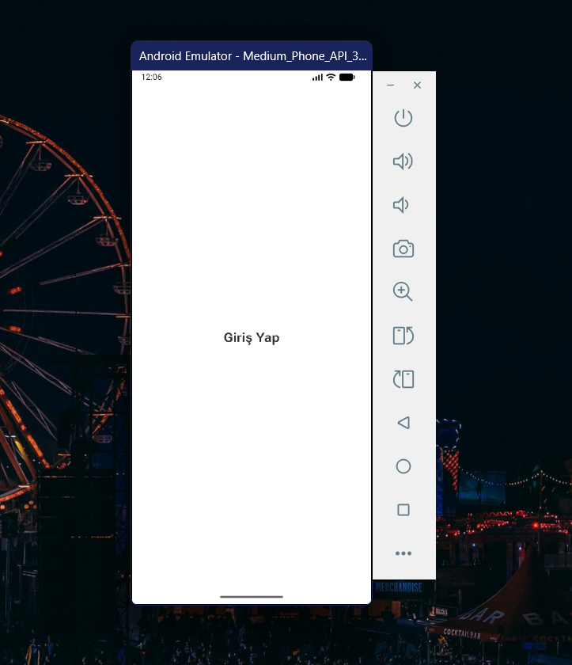
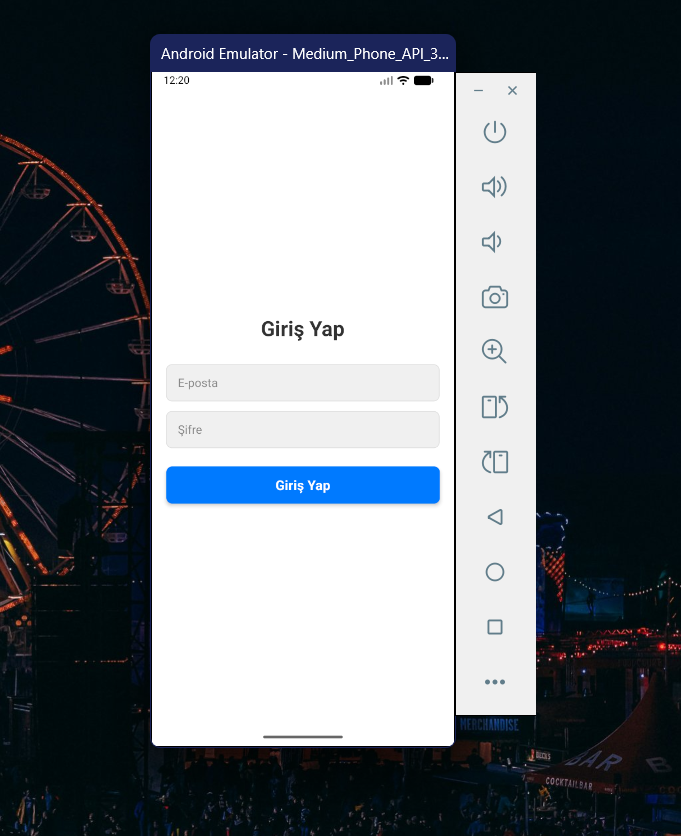
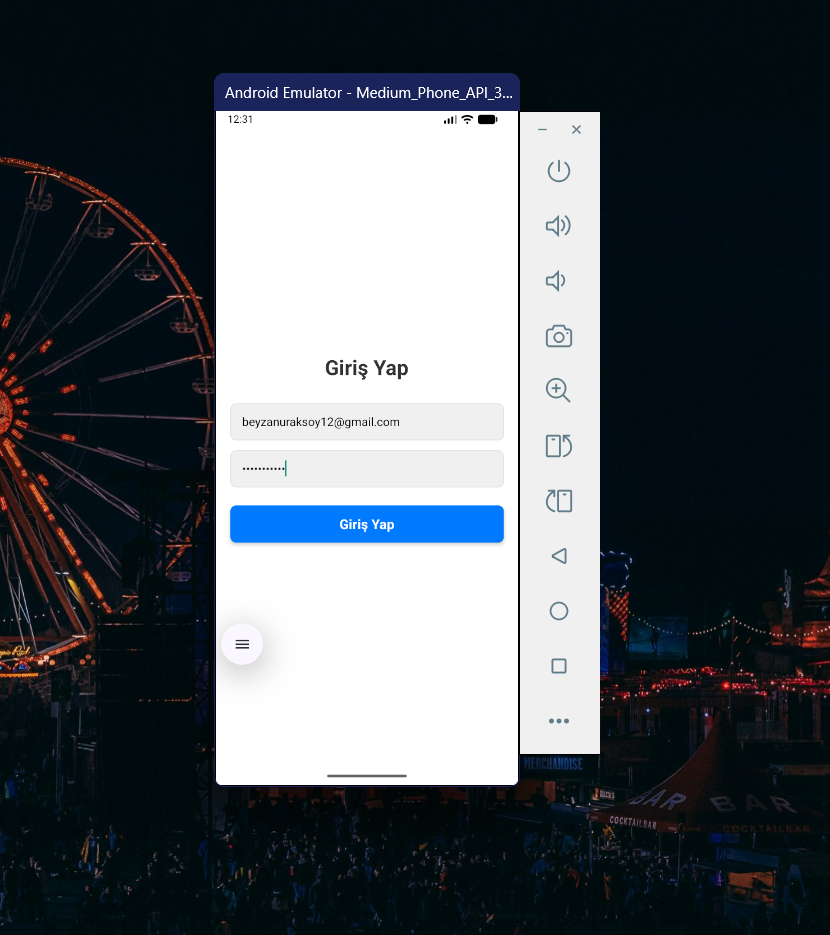

KampüsPost Mobil Uygulama Projesi - ÖDEV 4'ün eklentileri alt kısımda

2-Proje Oluşturma: npx @react-native-community/cli@latest init KampusPost komutu ile yeni React Native projesi oluşturdum.

3-Ana Ekran Düzenleme: App.tsx güncelleyerek uygulama açılışında LoginScreen bileşenini gösterttim.

4-Giriş Ekranı Oluşturma: components/LoginScreen.tsx dosyası oluşturdum.

5-Giriş Formu: E-posta ve Şifre giriş kutuları (TextInput) ve bir "Giriş Yap" butonu (TouchableOpacity) ekledim.

6-Yeniden Kullanılabilir Bileşen: components/CustomInput.tsx bileşeni oluşturdum ve LoginScreen içindeki tüm giriş kutularında kullanılarak kod tekrarının önlenmesini sağladım.

7-Değerleri Konsola Yazdırma: "Giriş Yap" butonuna basıldığında girilen e-posta ve şifre değerleri console.log() ile konsola yazdırılmaktadır

2. Adımın Ekran Görüntüsü: 

3. Adımın Ekran Görüntüsü:

4. Adımın Ekran Görüntüsü:

5. Adımın Ekran Görüntüsü:

6. Adımın Görüntüsü 5. Adım ile aynıydı SS istenmediği için ekleme yapmadım.

7. Adımın Ekran Görüntüsü:

ÖDEV 4:
Ödev kapsamında aşağıdaki yapıları ekledim:
-React Navigation (Stack Navigator)
-Login → Register → Home ekran akışı
-CustomInput bileşeni
-RegisterScreen’de şifre doğrulama
-HomeScreen’de uzak API’den veri çekme (JSONPlaceholder)
-FlatList ile gönderi listeleme

1. Proje Klasör Yapısı

2. Navigation Yapısı (App.tsx)

3. LoginScreen – Giriş Ekranı

4. HomeScreen – Gönderi Listesi (FlatList)

5. RegisterScreen – Arayüz

6. Şifreler Uyuşmuyor Uyarısı

7. Kayıt Başarılı Uyarısı

8. Konsol – Kayıt Başarılı Log'u

9. HomeScreen – Fetch Kodu

10. Konsol – Posts Data Array(100)

